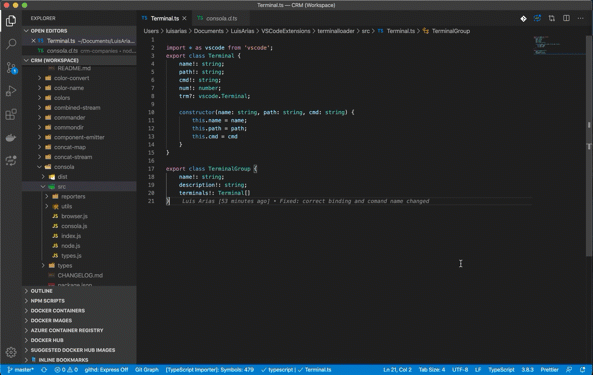

# Terminal loader

This extension allows to open multiple terminals stacked side by side and run a different command on each one. Perfect to work in a workspace with multiple projects.

## Features

Allow to configure and run pre configured commands.
Add a configuration file called LoadTerminal.json on the root folder.

## Installation ⬇

In vscode marketplace search and install "Terminal loader".  
Or launch the vscode quick open (<kbd>⌘</kbd>+<kbd>p</kbd> | <kbd>Ctrl</kbd>+<kbd>p</kbd>) and run `ext install terminal-loader`

## Releases

Published versions

- [See and download all versions](https://github.com/ariassd/vscode-load-terminals/tree/v2/release)
- [v1.1.0](https://marketplace.visualstudio.com/items?itemName=ariassd.terminal-loader)
- [v1.2.1](https://marketplace.visualstudio.com/items?itemName=ariassd.terminal-loader)
- [v2.0.0](https://github.com/ariassd/vscode-load-terminals/tree/v2/release)

## Commands 🗣

The extension commands that can be accessed from the command pallet (<kbd>⌘</kbd>+<kbd>Shift</kbd>+<kbd>p</kbd> | <kbd>Ctrl</kbd>+<kbd>Shift</kbd>+<kbd>p</kbd> ):

- `TLoader: Load Terminals` - Open pre configured terminals in file `LoadTerminal.json`
  ⚠️ IMPORTANT: A group called `groups` must exists in the configuration file for this, you can add extra groups, but please don't remove this one!



- `TLoader: Load Groups` - Open a group of terminals in file `LoadTerminal.json`. For the following example you can select groups or testEnv or both (groups,testEnv). A sample file is created when you run the extension the first time.

⚠️ IMPORTANT: Too many groups or crowded groups could cause VSCode freezing or stop working!

```javascript
{
   "version":"packageJson.version",
   "customGroup": [ ] // 👈 Defining a custom group to be loaded with `TLoader: Load Groups`
   "groups":[ // 👈 this is the default group
      {
         "name":"First group: Sample",
         "description":"First group of terminals and commands",
         "enabled":true,
         "terminals":[
            {
               "name":"--1g-1c",
               "path":".",
               "cmd":[
                  "echo first group first console!"
               ],
               "num":0
            }
         ]
      },
      {
         "name":"Second group: Sample",
         "description":"Second group of terminals and commands",
         "enabled":true,
         "terminals":[
            {
               "name":"--2g-1c",
               "path":".",
               "cmd":[
                  "echo Second group first console!"
               ],
               "num":0
            }
         ]
      }
   ]

}
```

## Workspace settings ☑

#### Setting Section: `terminalLoader.config`

- `directory`: Defines the name or location for the file `LoadTerminal.json`, relative to the workspace's parent folder.

  ```json
  {
    ...
    "terminalLoader.config": {
      "directory": ".vscode",
    }
  }
  ```

# License

[MIT](https://github.com/ariassd/vscode-load-terminals/blob/master/LICENSE)

## Requirements

- Visual Studio Code 1.53.0 or higher

## Latest release notes

### 1.2.1

- Fix: Naming new terminals ( not splitted )
- Know bug: Renaming splitted terminal does not work with vscode version 1.57.1
- Command list on configuration, Now you can define a list of commands to be executed in the configuration file.

[See full change log here](CHANGELOG.md)

---

## Help this extension be great 💪

If you want to contribute or have any feedback positive or negative, let me know!  
Contact via [Email](ariassd@gmail.com) or open an issue at this project's [Git Repo](https://github.com/ariassd/vscode-load-terminals).

- [Luis Arias | Github](https://github.com/ariassd)

_Thank you Nick Armitage for reporting issues._
_Thank you Leandro Silva and Anton Olsson for suggestions._

## Stay in touch

- Author - Luis Arias 2021 <<ariassd@gmail.com>>
  [GitHub profile](https://github.com/ariassd)

## License

This software is licensed under [MIT License](LICENSE)

 

May 2021
